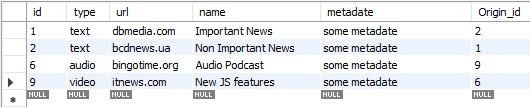

# Тестування працездатності системи

## Початкове наповнення таблиць

- User

    

- Role

    

- Request

    

- Origin

    

- Media

    

- Grant

    

## Робота з таблицею User

### Отримати всіх користувачів

### Отримати користувача за його id

### Додати нового користувача

### Видалити користувача за його id

### Змінити користувачу роль

## Робота з таблицею Media

### Додати новий медіа-контент

### Здійснити пошук серез існуючих медіа-контентів за ключовим словом

### Видалити медіа-контент за його id

## Робота з таблицею Origin

### Додати першоджерело

### Видалити першоджерело за його id

## Робота з таблицею Role

### Додати роль

### Додати до ролі нові права

### Видалити роль за її id

## Робота з таблицею Request

### Додати новий запит

### Отримати медіа-контент за запитом

### Видалити запит за його id

